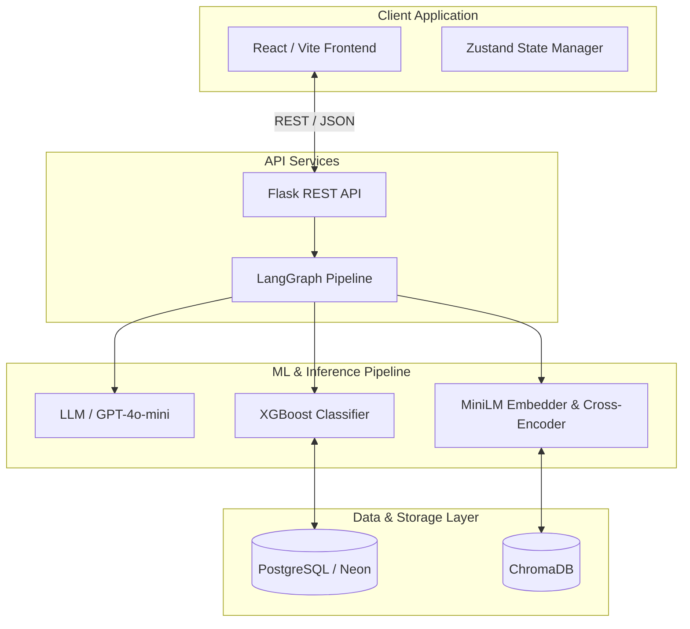

# HireLoop — Autonomous AI Recruiting Co-Pilot

> An intelligent, autonomous agentic pipeline designed to streamline candidate evaluation. HireLoop combines semantic retrieval with an adaptive Machine Learning classifier that actively learns and recalibrates to your hiring preferences in real-time.

**[Live Demo →](https://hire-loop-lac.vercel.app)** · **[Demo Video →](./demo.webp)**

---

## 🚀 Engineering & ML Differentiation

Traditional Applicant Tracking Systems rely heavily on rigid keyword matching. HireLoop introduces a paradigm shift by implementing a robust, actively learning MLOps architecture:

1. **Hybrid Retrieval & Semantic Scoring**: A LangGraph-orchestrated pipeline chunks and embeds resumes into ChromaDB. It utilizes cross-encoder reranking to retrieve highly relevant context, extracting structured features for an XGBoost classification model.
2. **Online Active Learning**: The core innovation. User interactions (approve/reject decisions) are systematically captured as training labels. Every 5 decisions, the XGBoost model dynamically refits on an aggregated dataset of the foundational seed and new human-in-the-loop feedback, continuously optimizing its decision boundaries to reflect nuanced user preferences.
3. **Explainable AI (XAI)**: Opacity is a critical flaw in modern ML products. HireLoop enforces interpretability by surfacing predictive contributions for every decision. The interactive "Criteria Drift" visualization exposes the evolving feature importance weights, enabling users to transparently monitor how the model adapts over time.

---

## 🏗 System Architecture

The application is built on a scalable, decoupled architecture with a strong emphasis on typed interfaces and stateful agentic workflows.



### Data & Execution Flow
1. **Parsing**: Job Description text is processed via an LLM to extract a structured criteria JSON.
2. **Embedding**: Candidate resumes are embedded via `all-MiniLM-L6-v2` and stored in ChromaDB.
3. **Feature Engineering**: For a given JD, features are computed:
   - `skill_overlap` (Jaccard Similarity)
   - `semantic_sim` (Cross-encoder Score)
   - `exp_gap` (Normalized Absolute Difference)
   - `keyword_density` (Domain Vocabulary Density)
4. **Inference**: XGBoost predicts probability (`fit_score`). Candidates are ranked.
5. **Feedback Loop**: Recruiter decisions trigger a background retraining task (`XGBoost.fit`), updating predictive weights and triggering a real-time UI re-ranking animation.

---

## 🧠 MLOps & Machine Learning Pipeline

### Model Training & Validation Rigor
The foundational model relies on a synthetically engineered dataset of 200 labeled pairs (incorporating strategic noise to simulate complex, non-linear edge cases). `trainer.py` enforces standard ML validation techniques, yielding strong initial performance metrics before deployment:

```text
[trainer] Val AUC:  0.9712
[trainer] CV AUC:   0.9680 ± 0.0142
              precision  recall  f1-score
    reject       0.97      0.94      0.95
   approve       0.94      0.97      0.95
```

### Continuous Adaptation
The `retrainer.py` module facilitates online adaptation. To prevent catastrophic forgetting, the model is retrained on a union of the `seed_df` and accumulated `feedback_df`. Complete model version histories, including performance metrics (`val_auc`) and shifting feature importances, are persisted via PostgreSQL.

### RAG Pipeline Integration
To capture implicit candidate qualifications, HireLoop implements an advanced Retrieval-Augmented Generation pipeline:
1. **Semantic Chunking**: Resumes are intelligently partitioned into headers, experience, and education/skills.
2. **Dual-Encoder Architecture**: `all-MiniLM-L6-v2` handles initial high-speed retrieval, while `cross-encoder/ms-marco-MiniLM-L-6-v2` executes precision reranking against JD constraints.

---

## 🛠 Technology Stack

| Domain | Technology | Engineering Rationale |
|---|---|---|
| **Frontend** | React, TypeScript, Vite, Zustand | Enforces strict type safety, predictable state updates, and rapid HMR. |
| **Backend** | Python, Flask, SQLAlchemy | Lightweight API layer optimized for serverless deployments. |
| **Orchestration** | LangGraph | Deterministic management of stateful LLM loops and conditional graphs. |
| **Machine Learning** | XGBoost, Sentence-Transformers | High-performance inference, inherent interpretability, local embedding execution. |
| **Infrastructure** | PostgreSQL (Neon), ChromaDB | Serverless relational scaling combined with ephemeral, file-based vector storage. |

---

## 💻 Local Development Setup

### Prerequisites
- Python 3.11+
- Node.js 18+
- OpenAI API Key

### Backend Initialization
```bash
cd backend
python -m venv venv
source venv/bin/activate   # Windows: venv\Scripts\activate
pip install -r requirements.txt

cp .env.example .env
# Configure .env: add OPENAI_API_KEY
# DATABASE_URL defaults to a local SQLite instance if omitted.

# Execute ML Initialization & Data Seeding
python -m ml.dataset    # Generate synthetic training distribution
python -m ml.trainer    # Train the base XGBoost artifact
python -m db.seed       # Provision tables and inject demo profiles

python app.py           # Initializes server on http://localhost:5000
```

### Frontend Initialization
```bash
cd frontend
npm install
npm run dev             # Initializes Vite dev server on http://localhost:5173
```
*Note: Vite handles local API proxying; no `.env` is required for the client in development mode.*

---

## 📡 API Reference

| Method | Endpoint | Purpose |
|---|---|---|
| `POST` | `/api/jd/parse` | LLM-assisted extraction of structural criteria from raw JD text. |
| `POST` | `/api/candidates/upload` | Ingestion, feature computation, and ML scoring of resume documents. |
| `GET`  | `/api/candidates/?jd_id=` | Retrieves ranked candidate arrays optimized for a specific JD. |
| `GET`  | `/api/candidates/:id/questions`| Generates adaptive, context-aware interview questions based on gap analysis. |
| `POST` | `/api/feedback/` | Registers user alignment decisions to influence the retrain trigger. |
| `POST` | `/api/model/retrain` | Forces immediate model refitting and feature weight recalculation. |

---

## 🛣 Engineering Roadmap & Future Scope

- **Document Processing Pipeline**: Migrate to robust OCR/LayoutLM integrations to handle non-standard, deeply nested PDF structures.
- **Multi-Tenant Architectures**: Expand the PostgreSQL schema and routing logic to support isolated, per-user model personalization states.
- **Asynchronous Task Queues**: Abstract the online retraining and embedding generation processes into Celery workers backed by Redis for enhanced throughput at scale.
- **A/B Performance Testing**: Implement a comparative view detailing ranking divergence between the base heuristic model and the actively adapted model.

---
*Designed to demonstrate applied machine learning, production-ready software architecture, and user-centric application design.*